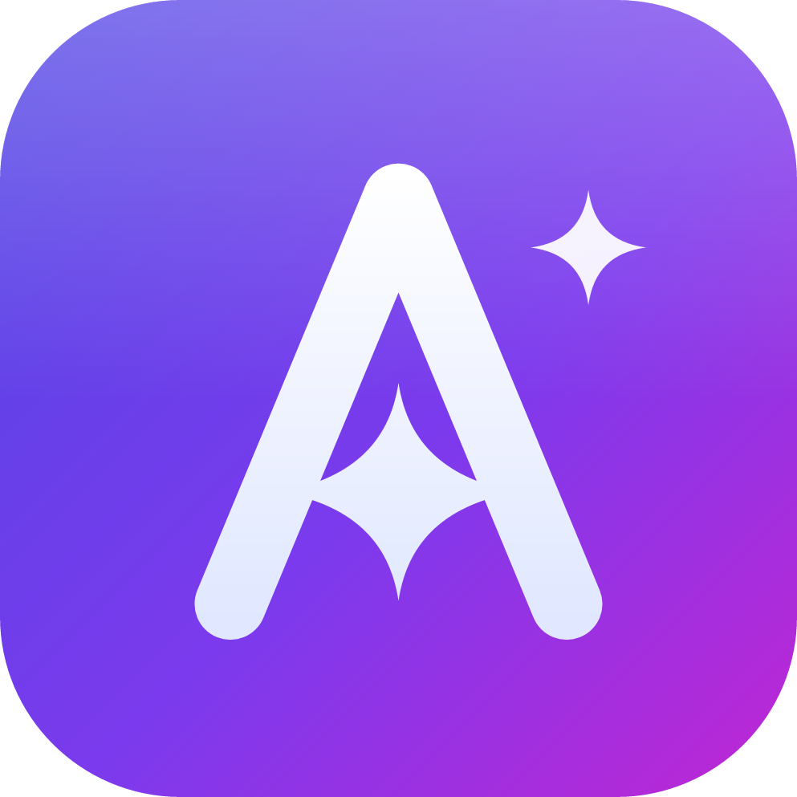

<div align="center">

# CodeAide（Claude or Codex）

> An independent fork of [CC GUI](https://github.com/zhukunpenglinyutong/jetbrains-cc-gui) — fully rebranded, MIT licensed.



**English** · [简体中文](./README.zh-CN.md)

</div>

**CodeAide** is a powerful JetBrains IDE plugin that provides a visual interface for the **Claude Code** and **OpenAI Codex** dual AI tools, making AI-assisted programming more efficient and intuitive.

This project is a secondary development ("二开") based on the open-source [CC GUI](https://github.com/zhukunpenglinyutong/jetbrains-cc-gui) (originally `idea-claude-code-gui`, MIT). It has been completely rebranded so that it never overlaps with the original plugin:

- New plugin id: `com.codeaide` (was `com.github.idea-claude-code-gui`)
- New Java package: `com.codeaide` (was `com.github.claudecodegui`)
- New tool window id `CodeAide`, new action id prefix `CodeAide.*`
- New resource bundle: `messages.CodeAideBundle`, new icon `codeaide-icon.svg`
- New user-data directory: `~/.codeaide` (was `~/.codemoss`), so CodeAide can be installed side by side with the original plugin without conflicts

All credit for the original work goes to the upstream authors and contributors.


---

## Key Features

### Dual AI Engine Support
- **Claude Code** - Anthropic's official AI programming assistant, supporting Opus 4.5 and other models
- **OpenAI Codex** - OpenAI's powerful code generation engine

### Intelligent Conversation
- Context-aware AI coding assistant
- @file reference support for precise code context
- Image sending support for visual requirement description
- Conversation rewind feature for flexible history adjustment
- Enhanced prompts for better AI understanding

### Agent System
- Built-in Agent system for automated complex tasks
- Skills slash command system (/init, /review, etc.)
- MCP server support to extend AI capabilities

### Developer Experience
- Comprehensive permission management and security controls
- Code DIFF comparison feature
- File navigation and code jumping
- Dark/Light theme switching
- Font scaling and IDE font synchronization
- Internationalization support (10 languages)

### Session Management
- History session records and search
- Session favorites
- Message export support
- Provider management (cc-switch compatible)
- Usage statistics analysis

---

## Project Status

The project is under active development. For version history and iteration progress, please read [CHANGELOG.md](CHANGELOG.md)

---

## Local Development and Debugging

### 1. Install Frontend Dependencies

```bash
cd webview
npm install
```

### 2. Install ai-bridge Dependencies

```bash
cd ai-bridge
npm install
```

### 3. Debug Plugin

Run in IDEA:
```bash
./gradlew clean runIde
```

### 4. Build Plugin

```sh
./gradlew clean buildPlugin

# The generated plugin package will be in the build/distributions/ directory
```

---

## Contributing

For contributing guidelines, please read [CONTRIBUTING.md](CONTRIBUTING.md)

---

## Acknowledgements

- Upstream project: [zhukunpenglinyutong/jetbrains-cc-gui](https://github.com/zhukunpenglinyutong/jetbrains-cc-gui) (CC GUI, originally Claude Code GUI) and all of its contributors.

---

## License

MIT (see [LICENSE](LICENSE))
